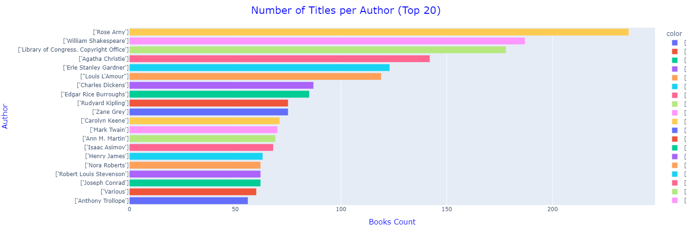
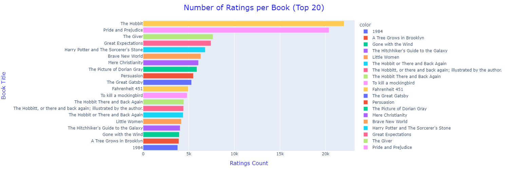
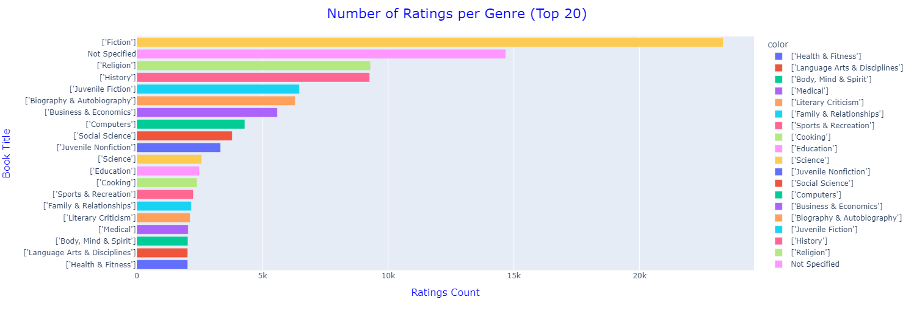
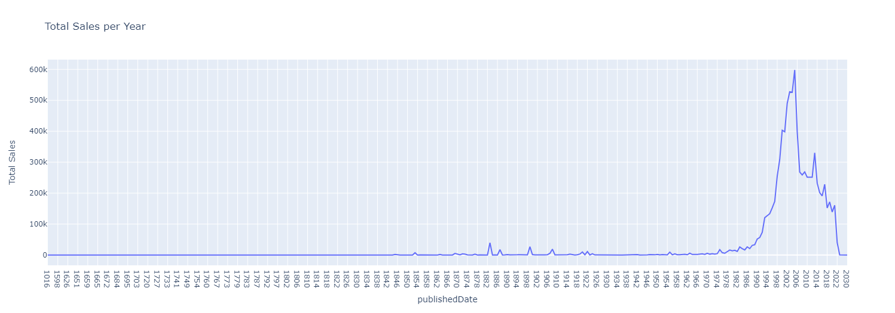
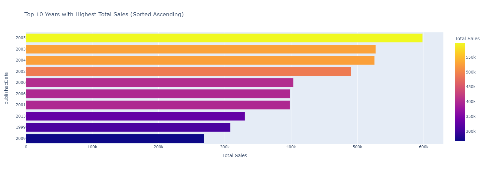

# Assignment 3: EDA Using Big Data

**GROUP NAME: KICAP SAMBAL**

**TEAM MEMBERS:**
```
MOHD NOR BIN MOHIDIN (MCS231008)
NABILA HUSNA BINTI ROSLI (MCS231009)
NUR AZIMAH BINTI MOHD SALLEH (MCS231011)
ZUHAYR ARIF BIN ZAKARIA (MCS231002)
```

## Introduction

### **Amazon Book Reviews**

#### **Dataset**
The dataset contains 2 files which are the first file named 'reviews' contain feedback about 3M user on 212404 unique books  and metadata from Amazon, including 142.8 million reviews spanning May 1996 - July 2014..
The second file named 'Books Details' contains details information about 212404 unique books. It file is built by using google books API to get details information about books it rated in the first file.

In this assignment, we'll focus on performing Exploratory Data Analysis (EDA) using the Amazon Book Reviews dataset. EDA is a crucial step in understanding the structure, patterns, and characteristics of a dataset. It involves a variety of techniques to summarize, visualize, and interpret key features of the data.

## Task Overview

### Data Loading
This dataset can be explored using Pandas. However, for the sake of the requirement of this assignment, we are using PySpark to do a summary of the statistic for numerical data.

### Data Cleaning and Preprocessing
Check for missing values, duplicate entries, and outliers. Handle or remove them appropriately to ensure data quality. This step describes the preliminary steps taken to prepare the data for analysis, including an acknowledgment of the limitations when considering big data.

### Exploratory Data Analysis
#### Data Wrangling and Statistical Summary
Compute descriptive statistics such as mean, median, standard deviation, and quartiles for numerical features. Understand the basic statistical properties of the dataset.

#### Data Visualization
1. This data visualiazation are run without running the code in Data Summary Statistic. Due to it takes a long time to convert dataframe of PySpark to dataframe of Pandas. You might encounter error if you run code in Data Summary Statistic.
2. There are a few graph are not shown in the preview. We will attach it here respectively to the code.






## Conclusion
Using a big data tools such as PySpark to handle this datasets is a waste of storage and time. This is because we need to change the PySpark DataFrame to Pandas DataFrame so it will be easy to integrate the analysis tools such as Matplotlib and Plotly. The convertion from PySpark DataFrame to Pandas DataFrame took a lot of time. 12 hours passed and the data that have successfully converted are not even half from the dataset.

If we really want to use the big data tools like PySpark, at least we should have 1 TB size of data. It would be more efficient.

We only able to apply a little bit of the use of big data tool for this dataset.


However, this assignment allow us to study EDA using big data tools.
